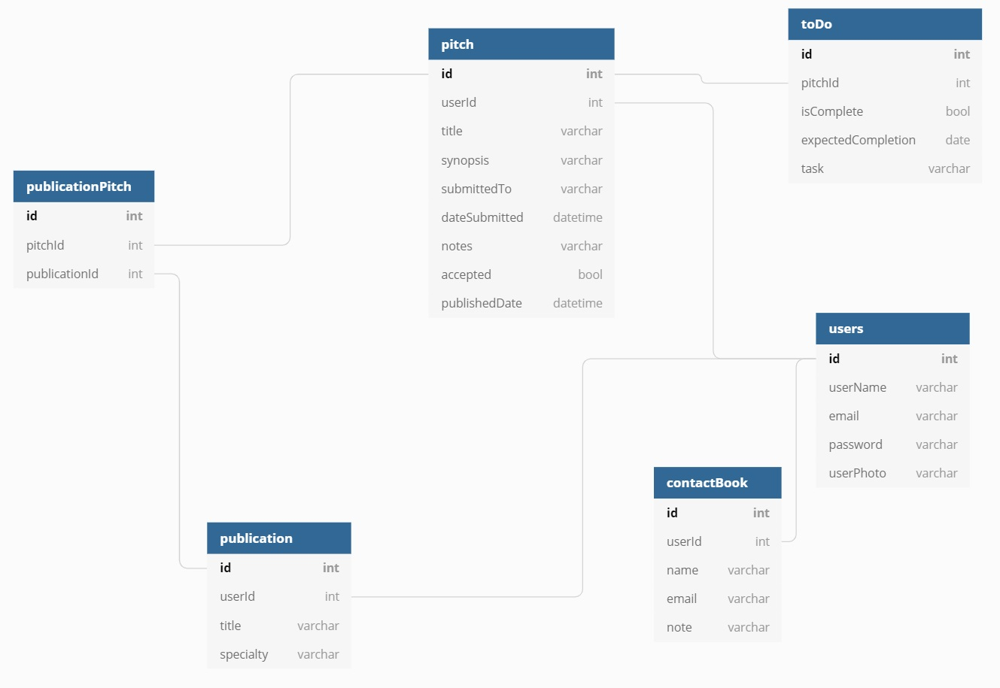

# Pitch Perfect
## An App For Freelance Writers
    
### What is Pitch Perfect?

An application to make the lives of freelance writers easier, Pitch Perfect helps writers keep track of pitches. This app does away with long, hard-to-read and maintain excel sheets as well as easy-to-lose notes. Keep track of pitch submissions, acceptances, publication dates, and publications that accept writers’ work.

### User Guide:
1. Register or log in with an email and password

2. Use the navigation bar to toggle between app features: new pitches, current pitches, publications, and user profile.

3. Log out to end user session.

### Pitch Perfect Features:
1. Pitches: Create a new pitch to track submission process and update it when it's (hopefully!) accepted for publication or need to make a note about its progress.

2. Publications: Keep track of different publications that pitches have been submitted to/accepted at.

3. User Profile: Personalize the app with your picture!
